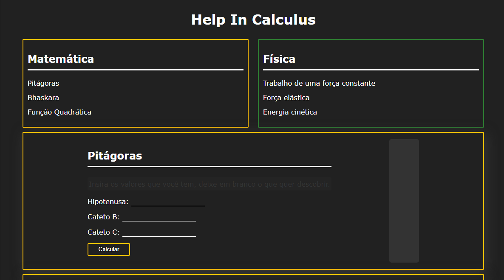

# Help In Calculus

> Linha adicional de texto informativo sobre o que o projeto faz. Sua introdução deve ter cerca de 2 ou 3 linhas. Não exagere, as pessoas não vão ler.

### Ajustes e melhorias

O projeto ainda está em desenvolvimento e as próximas atualizações serão voltadas nas seguintes tarefas:

- [ ] Sempre adicionar novas equações.

## ☕ Usando helpincalculus

Para usar helpincalculus, clique [aqui](https://joaopedrov0.github.io/helpincalculus)

No card da equação que você deseja usar, basta inserir todas as informações que você tem, o que quiser descobrir deixe em branco, e pressione o botão "Calcular"

<!--
## 📝 Licença

Esse projeto está sob licença. Veja o arquivo [LICENÇA](LICENSE.md) para mais detalhes.

[⬆ Voltar ao topo](#helpincalculus) 
-->
